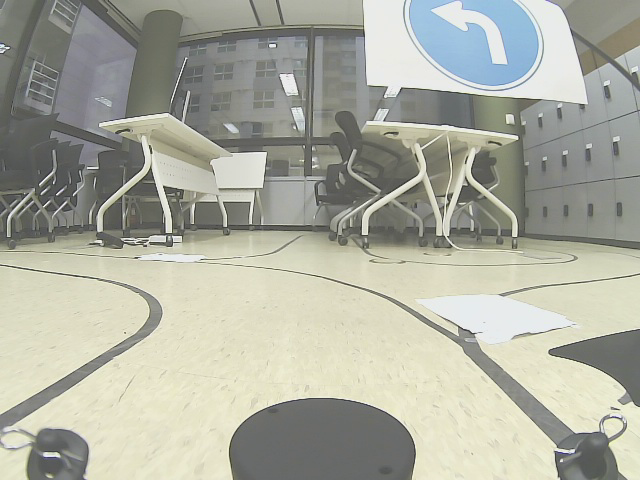
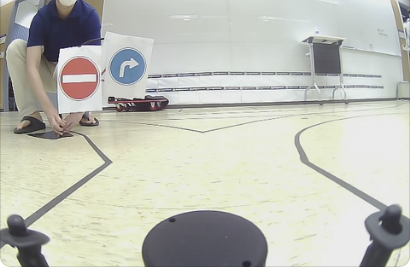
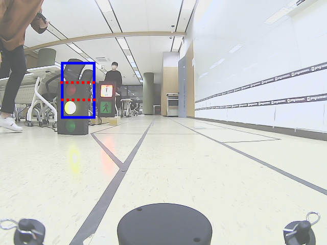

# 프로젝트1 - 표지판 검출

---

### 👥 팀원

**강정구, 김도현, 이치현, 조성종**

---

### ⁉️ **프로젝트 목적**

**1-1. 인식**

객체 인식을 위한 딥러닝 모델인 Darknet의 YOLOV3-tiny을 이용하여 주어진 데이터를 전처리·학습시키고, 인식할 수 있다.

**1-2. 주행**

학습된 데이터를 바탕으로 인식된 객체가 지닌 함의에 따라 차선을 벗어나지 않고 주행할 수 있다.

---

### 🛣️ TSTL 인식 및 제어 프로세스

 **2-1. 인식**
    
    
     **2-1-2. 영상 처리**
        
        ⓐ 허프라인 기반 차선 인식 처리
        
        - birdeye-view 로 warp
        - canny edge detector → hough
        
        ⓑ 교차로 인식 처리
        
        - ROI 부분에서 양 쪽의 차선이 인식되지 않으면 angle값을 0으로 처리
        
        ⓒ 신호등 인식 처리
        
        - inRange를 이용하여 HSV이미지의 V(명도) 기준으로 Binary 이미지로 만든 후, 바운딩 박스를 3등분 하여, nonzero가 가장 많은 부분을 해당 신호로 처리

 **2-2. 제어**
    
    ⓐ PID 제어
    
    ⓑ 가중이동평균필터
    

 **2-3. 로직**
    
    
    

---

### ⚠️ **TSTL 인식 및 제어 성능 향상을 위한 방법**

<aside>
🚦 **기준**

- AP, F1 score, Precision, Recall의 네 가지 평가 지표 중 Confusion Matrix를 이용하여 해석이 용이한 Precision 및 Recall을 중심으로 학습 결과를 해석 및 개선하고자 하였다.
- 그 중, 일반적으로 Precision이 0.6 이상이 되어야 한다는 강사님의 조언을 바탕으로 성능을 향상하고자 하였다.
</aside>

- **3-1. 인식**
    - **3-1-1. 학습 데이터의 구성**
        
        ⓐ 데이터 양 
        
        - 기본 : 766장
        - 추가 : 345장
        
        ⓑ 각 클래스 당 데이터 수
        
        - left : 373
        - right : 426
        - stop : 361
        - crosswalk : 24
        - traffic_light : 92
    
    - **3-1-2. Augmentation 적용**
        
        **ⓐ input resolution 변경** 
        
        - 처음 모델의 경우, 학습 속도를 생각하여 352 해상도의 yolo-tiny를 사용했으나, 작은 표지판의 경우 인식을 제대로 하지 못 하는 문제가 발생하여, 416 해상도의 yolo-tiny를 사용하였다.
        
        **ⓑ 적절한 Augmentation 사용**
        
        - 기본적으로 제공된 Augmentation 옵션은 아래와 같다.
            
            ```python
            class DefaultAug(ImgAug):
                def __init__(self, ):
                    self.augmentations = iaa.Sequential([
                        iaa.Sharpen((0.0, 0.1)),
                        iaa.Affine(rotate=(-0, 0), translate_percent=(-0.1, 0.1), scale=(1.0, 3.0)),
                        iaa.AddToBrightness((-40, 60)),
                        iaa.AddToHue((-10, 10)),
                        iaa.Crop(percent=(0, 0.2))
                    ])
            ```
            
        
        - AddToBrightness의 경우, 자이카의 주행환경의 조도 변화가 크지 않을 것이라 판단하여, -30 ~ + 30 사이의 값으로 조절하였다.
        
        - AddToHue의 경우, image color space를 HSV로 변환 후, H값을 조정하는 것이기에, 색이 중요한 traffic sign을 학습하는데 부정적일 것이라는 판단으로 적용하지 않았다.
        
        ```python
        class DefaultAug(ImgAug):
            def __init__(self, ):
                self.augmentations = iaa.Sequential([
                    iaa.Sharpen((0.0, 0.1)),
                    iaa.Affine(rotate=(-0, 0), translate_percent=(-0.1, 0.1), scale=(1.0, 3.0)),
                    iaa.AddToBrightness((-30, 30)),
                    iaa.Crop(percent=(0, 0.2))
                ])
        ```
        
        **ⓒ fine-tuning 적용**
        
        - 첫번째 학습을 하고 난 후 모델을 적용하였더니, 다음과 같이 warping된 sign은 인식하였으나, 오히려 정상적인 sign은 인식하지 못 하였다.
            
            
            
        
        - 특히, stop, right sign이 그런 경향성이 높았기에, 기존 라벨링 된 데이터에서 작거나 흐릿한 데이터의 라벨링은 제거하고, 아래와 같이 명확하게 촬영된 이미지 약 350여장을 추가하여 fine-tuning을 적용하였다.
            
            
            
        - 기존에 형성된 weight에 크게 영향을 미치는 것을 방지하기 위하여, learning rate를 기존 lr에서 1/10으로 줄여서 학습을 진행하였다.
    

- **3-2. 제어**
    
    ⓐ Moving Average 적용
    
    - 곡선 → 직선 구간에서 안정성을 높이기 위하여 Moving Average를 적용
        
        ```python
        class MovingAverage:
            def __init__(self, n):
                self.samples = n
                self.data = []
                self.weights = list(range(1, n+1))
        
            def add_sample(self, new_sample):
                if len(self.data) < self.samples:
                    self.data.append(new_sample)
                else:
                    self.data = self.data[1:] + [new_sample]
        
            def get_wmm(self):
                s = 0
                for i, x in enumerate(self.data):
                    s += x * self.weights[i]
                return float(s) / sum(self.weights[:len(self.data)])
        
            def get_mm(self):
                s = 0
                for x in self.data:
                    s += x
                return float(s) / self.samples
        ```
        

---

### ⭐ 적용 결과

- **4-1. 인식**
    - **4-1-1. 표지판 인식**
        
        
        
        ( 급격하게 evaluation 수치들이 높아진 것은, train 데이터로 evaluation을 진행했기 때문이다 )
        
        - 따라서 순수 eval 데이터로, 위에서 진행한 성능 향상 기법들을 적용하여 평가한 자료가 없기에 정량적인 비교를 할 수는 없었다.
        
        - 하지만 xycar에 적용할 시, warping된 traffic sign뿐 아니라, warping되지 않은 것 또한 제대로 인식하였고, 특히 우려했던 stop, right sign을 매우 잘 인식하였기에, 성능이 향상되었음을 경험적으로·간접적으로 알 수 있었다.
            
            (데이터를 추가하여 fine-tuning을 한 후, training data로 시행한 evaluation 중, 성능이 낮았던 right sign에 대한 평가는 **| 1 | right | 0.98514 | 0.88608 | 0.98592 | 0.93333 |** 로, 학습이 잘 되고 있었음을 알 수 있다.)
            
        
        - 이러한 학습을 바탕으로 traffic sign test에서, traffic sign을 인식하지 못 하거나, 잘못 인식한 경우는 나타나지 않았다(12 / 12개).
        
        - 하지만 시간 부족으로 절대적인 학습량이 부족했던 것은 아쉬움으로 남는다.
    
    - **4-1-2. 영상 처리**
        
        ⓐ 허프라인 기반 차선 인식
        
        - 타팀과 동일한 환경에서 주행했음에도 불구하고 차선을 제대로 인식하지 못 하여 차선을 이탈한 경우가 다수였다.
        
        ⓑ 교차로 인식 처리
        
        - 차선 인식 및 제어가 제대로 통제되지 않아, 교차로 인식도 부족한 모습을 보였다.
        
        ⓒ 신호등 인식 처리
        
        - 우선 신호등 클래스를 인지한 후 HSV중 H(색상)를 기준으로 신호를 검출하고자 하였다. 그러나 H의 inRange 조절의 실패로 아래와 같이 이중 신호를 검출하는 등, Binary 영상을 제대로 검출하지 못 했다.
            
            
            
        
        - 차선책으로 팀이 사용한 V 기준으로 신호등 색상 인식을 성공적으로 수행하였다.
            
            .png)
            
        
        - 그러나 아래와 같이 Bounding Box가 제대로 쳐지지 않는 경우, 신호를 오인식 하는 경우가 발생하기도 했다. 아래와 같은 경우는, 노란불이기에 멈추어야 하지만, Bounding Box 기준으로는 초록불로 인식될 수 있다.
            
            
            

- **4-2. 제어**
    - 전체적으로 표지판/신호등 인식에 대한 로직과 그에 따른 영상처리에 기반하여 angle값 변환이나 속도변환이 이루어졌다.
    

---

### ✅ 결론

- 1️⃣ **인식**
    
    ⓐ 표지판 인식
    
    - 프로젝트 목표인 YOLOV3-tiny을 이용하여 주어진 데이터를 전처리·학습 및 인식은 충분히 수행하였다.
    
    ⓑ 영상 처리
    
    - 허프라인 기반 차선 인식
        - 어느 환경에서도 차선을 제대로 인식할 수 있는 인식 조건이 필요하다.
    
    - 교차로 인식 처리
        - 교차로 인식을 처리하기 위해선 제어가 완벽히 통제될 필요가 있다.
        
    - 신호등 인식 처리
        - 팀이 사용한 방법을 사용하기 위해선 신호등에 대한 완벽한 Bounding Box가 전제될 필요가 있다.
        - Bounding Box가 오류가 날 가능성을 대비해 다른 신호등 인식 방법도 준비해야 할 필요가 있다.
        - 추가적으로 학습을 초록색 신호등 클래스와 빨간색 신호등 클래스로 나눠서 학습을 시키는 방법도 고려할 필요가 있다.
        - 신호등의 옆면, 뒷면을 신호등이라고 인식하는 문제가 발생함에 따라 신호등의 옆면을 ignore 클래스로 학습시키는 방법을 고려할 필요가 있다.

- 2️⃣**제어**
    
    ⓐ 차선 인식
    
    - 시간이 부족하여 정교한 제어 실패
    - 직선 구간에서 한쪽 차선만 인식되었을 때의 처리가 미흡해서 곡선 구간에 대한 정교한 튜닝과 로직을 보완할 필요가 있다.
    - 교차로에서 직진을 안하고 우회전/좌회전하는 문제를 대비해 ROI를 여러 부분을 보고, 튜닝을 진행하여 교차로라는 것을 확실히 인식시킬 필요가 있다.
    

---
